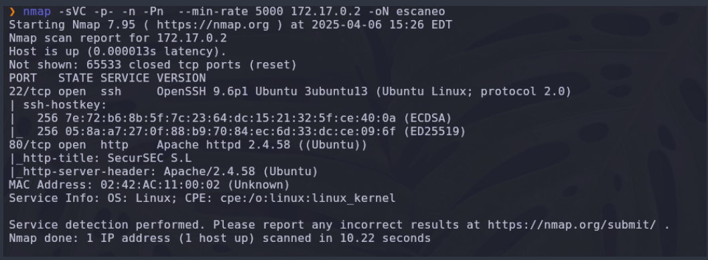
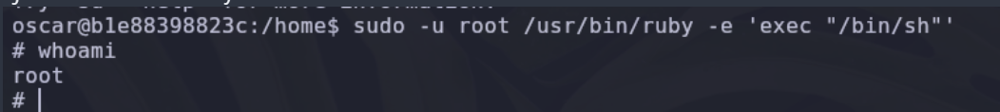

# Escaneo

Realizamos un escaneo con nmap

`nmap -sVC -p- -n -Pn  --min-rate 5000 172.17.0.2-oN escaneo` 

Observamos que tenemos el puerto 80 y el puerto 22 abiertos, por lo que en el navegador web colocamos la dirección IP de la maquina victima.

Encontramos 2 posibles usuarios *carlota* y *juan*.
Utilizando *hydra* realizamos una ataque de fuerza bruta para encontrar la posible contraseña del usuario carlota 

Encontramos la password asi que nos logeamos utilizando el puerto 22 ssh.

Una vez dentro de la maquina podemos ver que existen 3 usuarios por lo que tenemos que hacer el pivoting 

Dentro del directorio de carlota encontramos una *iagen-jpg* por lo que para poderla analizar creamos un servidor en python 

En nuestra maquina atacante obtenemos la imagen de la maquina victima 

Con la herramienta *steghide* extraemos la información que podría estar encriptada dentro de la imagen.

Obtenemos un archivo *secreto.txt* asi que lo leemos con cat y vemos que tiene un hash

Utilizando una web para desencriptar encontramos lo que podría ser la contraseña del usuario *oscar*

Accedemos como usuario oscar.

Ejecutamos el comando *sudo -l* para encontrar que binarios podemos ejecutar como usuario root

En la pagina de GTObins buscamos el binario de ruby 

Ejecutamos el binario y somos root.

 #                                P W N E D !

