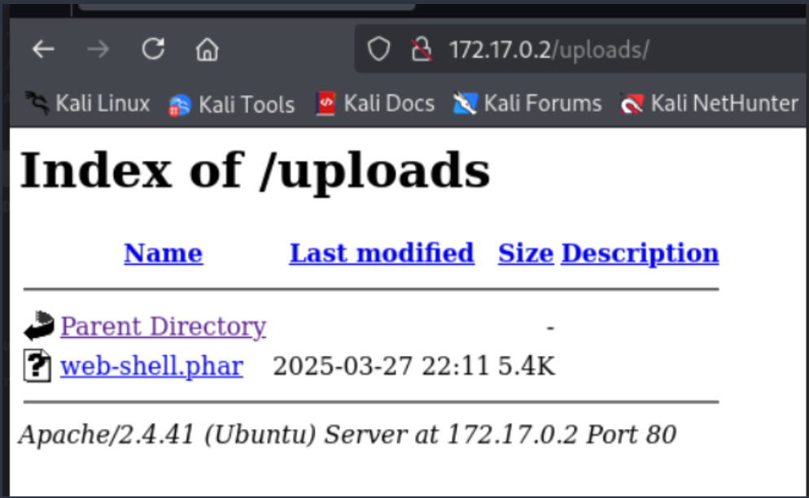
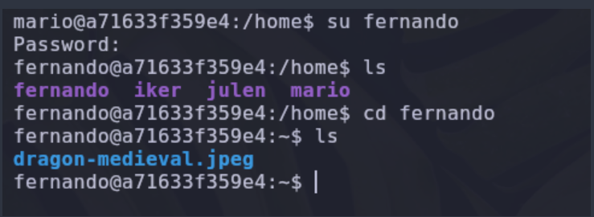
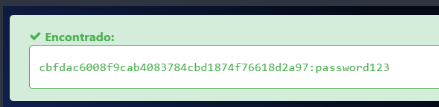
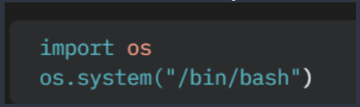

# ESCANEO

Realizamos un escaneo de puertos utilizando nmap 

Podemos ver el puerto 21 y 80 (ftp y http respectivamente ) están abiertos.
Utilizando el puerto ftp intentamos acceder con el usuario Anonymous y exitosamente entramos.
Listando el contenido podemos ver que existe un archivo .txt asi que ese archivo lo descargamos en nuestra maquina atacante.

Al leer el archivo sabemos que existe un hash, asi que utilizando la web de hashes.com identificamos el tipo de hash y nos arroja que puede ser un hash MD5.

Desencriptamos el contenido y encontramos lo que podría ser un usuario.

En la web no encontramos nada interesante ya que solo existe la pagina de un servidor apache 

Revisando el Source Page encontramos un comentario que podría ser de ayuda mas adelante.

Utilizando *gobuster* hacemos un fuzzing web para encontrar directorios dentro de la web.

Encontramos  2 directorios

- /uploads.php
- /file_uploads.php

En el directorio *file_uploads.php* encontramos una sección donde podemos subir un archivo por lo que podemos intentar subir una web_shell.php 

Utilizando una Webshell cambiaremos los parámetros necesarios para que podamos tener acceso a la maquina. Por lo que cambiamos ip y puerto.

Dado que no nos permite subir un archivo .php intentamos subir un archivo .phar y este se sube con exito.

Actualizamos nuestro directorio /uploads.php y encontramos nuestra web-shell.phar que acabamos de subir

Por otro lado en una terminal nos ponemos a la escucha y colocamos el puerto que usamos en la webshell que subimos a la web.
Al ejecutar el archivo en la web, esta nos permite entrar en la maquina con éxito.

Ejecutaremos un comando para saber los usuarios existentes en el maquina

Sabemos que existen 4 usuarios 

- julen 
- mario
- iker 
- fernando

Dado que somos el usaurio www-data ejecutaremos un archivo .sh para utilizar la fuerza bruta y encontrar la contraseña de algunos de los usuarios.
La herramienta que usamos es [SuForce](https://github.com/Maalfer/Sudo_BruteForce) ,con esta herramienta podemos utilizar la fuerza bruta y acceder.

Asi que en nuestra maquina atacante levantaremos un servidor con python y en nuestra maquina victima utilizando *wget* lo jalaremos.

Además de eso necesitaremos una wordlist asi que utilizaremos la de rockyou.txt y de igual manera la compartiremos por el servidor de python que tenemos levantado.

Descargamos la wordlist en nuestra maquina victima 

Ejecutamos el script para la fuerza bruta e intentaremos primero con el usuario Fernando 

Encontramos la contraseña 

Intentaremos hacer lo mismo con el usuario *mario* 

y también encontramos la password 

Otra manera de encontrar la contraseña del usuario *mario* es utilizando esteganografía de la siguiente manera 
Sabemos que dentro del directorio de fernando está una imagen la cual descargaremos en nuestra maquina atacante asi que levantamos un servidor python.

Descargamos la imagen en nuestra maquina atacante 

utilizando la herramienta de *stegcracker* y una wordlist haremos esteganografía en la imagen.

Nos genera un archivo .out el cual parece que es un hash

Utilizamos *hash_identifier* para saber que tipo de hash es y al parecer es un hash SHA-1

Desencriptamos el contenido y obtenemos la password del usuario *mario*

Accedemos al usuario y ejecutamos el comando sudo-l  para saber que binarios podemos ejecutar para pivotar entre usuarios y nos damos cuenta que podemos ejecutar el binario awk como usuario *julen*

En la web de GTObins buscamos el binario y encontramos el comando para ejecutar y pivotar de usuario

Ejecutamos el comando como *julen* y accedemos al usuario.

Una vez mas ejecutamos el comando sudo -l para saber que binarios podemos ejecutar y averiguamos que *env* es un binario que podemos ejecutar como usuario *iker*.

Ejecutamos el comando siguiente como usuario iker y pivotamos al usuario iker.

Por ultima vez ejecutamos el comando sudo -l y nos damos cuenta que para esvcalar privilegios a root podemos ejecutar el python y el archivo llamado geo_ip.py

Dicho archivo lo borramos y creamos uno con el mismo nombre con el siguiente contenido 

Ejecutamos el binario python con el archivo que acabamos de crear y nos convertimos en root.

 
 #                                P W N E D !
